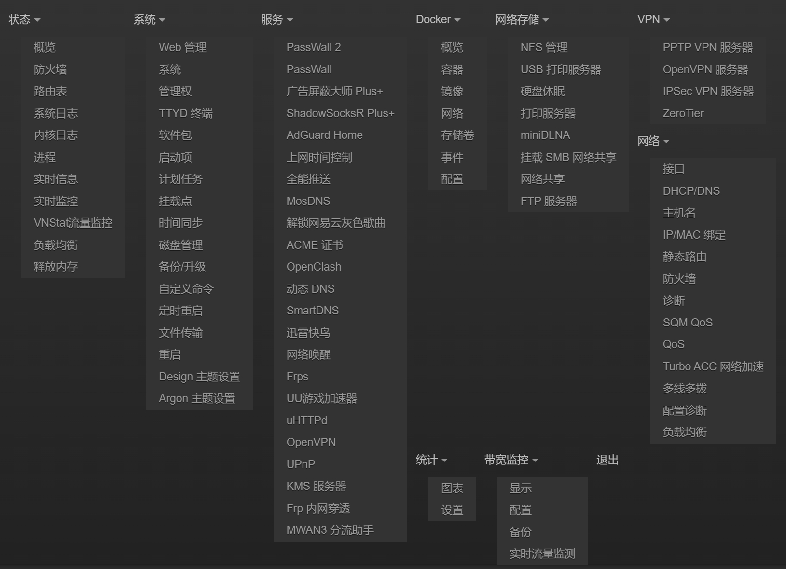
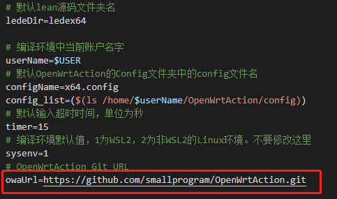
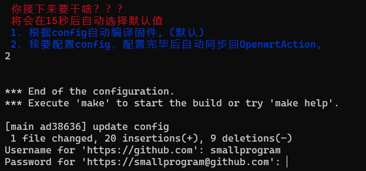
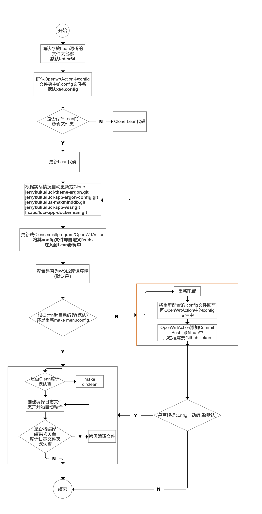

[](https://github.com/smallprogram/OpenWrtAction/releases)  [](https://github.com/coolsnowwolf/lede) [](https://github.com/smallprogram/OpenWrtAction/releases) [](https://github.com/smallprogram/OpenWrtAction/actions) [](https://github.com/smallprogram/OpenWrtAction/blob/main/LICENSE)


# [English Readme](README_EN.md)

# [最新固件列表，点击自取](https://github.com/smallprogram/OpenWrtAction/tags)

# 感觉不错的话，给个Star吧

# 目录<!-- omit in toc --> 
- [新增TG跟Wechat推送说明](source/bot.md)
- [Lean Openwrt GitHubAction](#lean-openwrt-githubaction)
    - [目前包含x86与R4S固件,根据源码更新自动编译](#目前包含x86与r4s固件根据源码更新自动编译)
  - [包含内容](#包含内容)
      - [包含各种常用插件，特殊的内容如下：](#包含各种常用插件特殊的内容如下)
  - [config列表](#config列表)
  - [argon主题的背景资源](#argon主题的背景资源)
  - [具体功能组件相关截图：](#具体功能组件相关截图)
  - [wsl2op.sh本地自动编译shell脚本说明](#wsl2opsh本地自动编译shell脚本说明)
    - [执行方式](#执行方式)
      - [首次执行](#首次执行)
      - [二次执行](#二次执行)
    - [执行过程详解](#执行过程详解)

# Lean Openwrt GitHubAction


### 根据源码更新自动编译


## 包含内容

#### 包含各种常用插件，特殊的内容如下：

> 由于SSRP目前与Xray冲突，暂时移除
> 移除一系列下载工具

|名称|类型|简介|源码地址
-|-|-|-
|~~SSRP~~|~~插件~~|~~Lean源码的亲儿子，评测说效率最高~~|~~https://github.com/fw876/helloworld~~|
|PassWall|插件|一款功能强大的科学工具|https://github.com/xiaorouji/openwrt-passwall|
|PassWall2|插件|一款功能强大的科学工具|https://github.com/xiaorouji/openwrt-passwall2|
|DockerMan|插件|OP上玩Docker的必备插件|https://github.com/lisaac/luci-app-dockerman|
|新版argon主题|主题|十分漂亮的OP主题|https://github.com/jerrykuku/luci-theme-argon|
|Argon Config|插件|新版argon主题的设置插件|https://github.com/jerrykuku/luci-app-argon-config|
|AdguardHome|插件|屏蔽广告插件|https://github.com/rufengsuixing/luci-app-adguardhome.git|
|广告屏蔽大师Plus+|插件|屏蔽广告插件|lean code source|
|京东签到|插件|白嫖京豆插件|lean code source|
|PushPlus全能推送|插件|钉钉、企业微信推送、Bark、PushPlus各种推送|https://github.com/zzsj0928/luci-app-pushbot|
|网易云音乐Unlock|插件|周杰伦出现在网易云音乐|lean code source|
|UU加速器|插件|土豪玩家必备插件，加速PS5 Switch等|lean code source|
|FRP|插件|内网穿透|lean code source|
|MWAN3|插件|多线的负载均衡|lean code source|
|~~Transmission~~|~~插件~~|~~下载器~~|~~lean code source~~|
|~~Aria2~~|~~插件~~|~~下载器~~|~~lean code source~~|
|~~qBittorrent~~|~~插件~~|~~下载器~~|~~lean code source~~|
|~~Aliyun-WebDav~~|~~插件~~|~~下载器~~|~~lean code source~~|
|~~SSR Python Server~~|~~服务~~|~~SSR服务端~~|~~lean code source~~|
|OpenVPN Server|服务|OpenVPN服务端|lean code source|
|PPTP VPN Server|服务|PPTP VPN服务端|lean code source|
|IPSec VPN Server|服务|IPSec VPN服务端|lean code source|
|ZeroTier|插件|内网穿透工具|lean code source|
|多线多播|插件|多线多播工具|lean code source|
|Turbo ACC|插件|网络加速器|lean code source|
|vim|工具|Linux 系统上一款文本编辑器，它是操作Linux 的一款利器|lean code source|
|nano|工具|比vi/vim要简单得多，比较适合Linux初学者使用|lean code source|
|Openssh-sftp-server|服务|sshd内置的SFTP服务器|lean code source|

## config列表
|适用平台|KERNEL大小|ROOTFS大小|地址|
-|-|-|-
X86平台|128Mb|1024Mb|https://github.com/smallprogram/OpenWrtAction/blob/main/config/x64.config|
Pi4_Model_B|128Mb|1024Mb|https://github.com/smallprogram/OpenWrtAction/blob/main/config/Pi4_Model_B.config
R4S软路由|128Mb|1024Mb|https://github.com/smallprogram/OpenWrtAction/blob/main/config/R4S.config
R2S软路由|128Mb|1024Mb|https://github.com/smallprogram/OpenWrtAction/blob/main/config/R2S.config
R2C软路由|128Mb|1024Mb|https://github.com/smallprogram/OpenWrtAction/blob/main/config/R2C.config

## 具体功能组件相关截图：



## wsl2op.sh本地自动编译shell脚本说明

运行前请确保你的编译环境已经安装Lean源码中要求的编译环境，并且使用非root用户执行。


注意，如果Fork我的Respository之后，需将修改的config同步回github，

首先需要**修改wsl2op.sh脚本中owaUrl变量值，改为你Fork后的git Url**



之后需要输入<b>github用户名</b>与<b>github Token</b>

**github Token请自行在自己的Github Settings --> Developer settings --> Personal access tokens中创建**



当然如果你嫌麻烦，也可以直接PR你的config到我的仓库config文件夹下，这样你就可以直接不同步编译了

### 执行方式
#### 首次执行
```shell
cd
git clone https://github.com/smallprogram/OpenWrtAction.git
cd OpenWrtAction
bash wsl2op.sh
```
#### 二次执行
```shell
cd
cd OpenWrtAction
git pull
bash wsl2op.sh
```

### 执行过程详解

