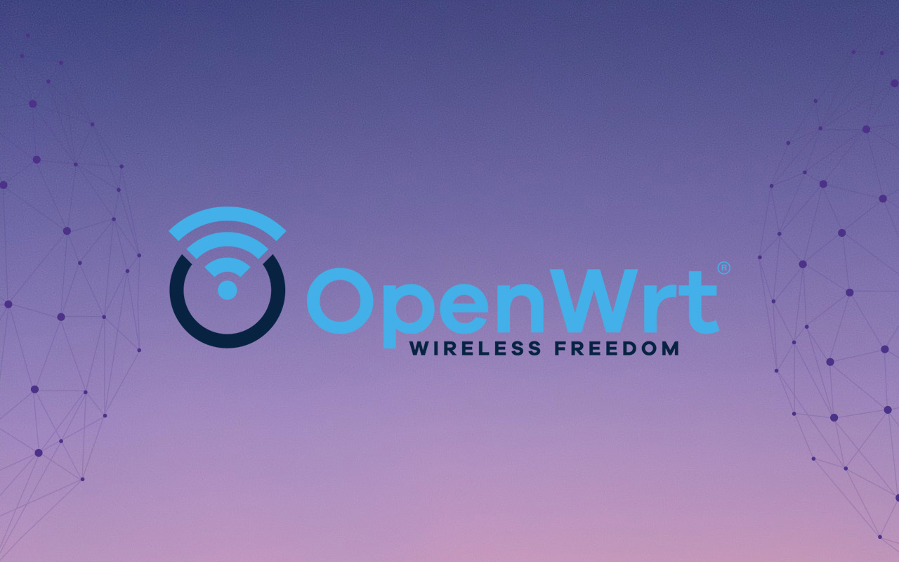

<div align="center">


<h1>OpenWrt — 多平台多设备固件云编译</h1>
</div>


<!-- <p align="center">
           
</p > -->

<div align="center">

[](https://visitorbadge.io/status?path=https%3A%2F%2Fgithub.com%2Fsmallprogram%2FOpenWrtAction)     [](https://github.com/smallprogram/OpenWrtAction/blob/main/LICENSE?style=flat-square)


</div>

---
[](README_CN.md)  [](README_EN.md)

---

## 💻 代码源
<!-- <div align="center">

[](https://github.com/immortalwrt/immortalwrt) [](https://github.com/coolsnowwolf/lede) [](https://github.com/openwrt/openwrt)

</div> -->

[](https://github.com/immortalwrt/immortalwrt)
```
.___                               __         .__
|   | _____   _____   ____________/  |______  |  |
|   |/     \ /     \ /  _ \_  __ \   __\__  \ |  |
|   |  Y Y  \  Y Y  (  <_> )  | \/|  |  / __ \|  |__
|___|__|_|  /__|_|  /\____/|__|   |__| (____  /____/
          \/      \/  BE FREE AND UNAFRAID  \/
 -------------------------------------------------------------------------
 ImmortalWrt SNAPSHOT, https://github.com/immortalwrt/immortalwrt
 -------------------------------------------------------------------------
 ```
[](https://github.com/openwrt/openwrt)
 ```

  _______                     ________        __
 |       |.-----.-----.-----.|  |  |  |.----.|  |_
 |   -   ||  _  |  -__|     ||  |  |  ||   _||   _|
 |_______||   __|_____|__|__||________||__|  |____|
          |__| W I R E L E S S   F R E E D O M
 -------------------------------------------------------------------------
 OpenWrt SNAPSHOT, https://github.com/openwrt/openwrt
 -------------------------------------------------------------------------

```
 [](https://github.com/coolsnowwolf/lede)

```
     _________
    /        /\        _    ___ ___  ___
   /  LE    /  \      | |  | __|   \| __|
  /    DE  /    \     | |__| _|| |) | _|
 /________/  LE  \    |____|___|___/|___|
 \        \   DE /
  \    LE  \    /  -------------------------------------------------------
   \  DE    \  /    OpenWrt SNAPSHOT, https://github.com/coolsnowwolf/lede
    \________\/    -------------------------------------------------------
```


---

## ⚙️ 工作流
|ActionStatus|Network Support|Latest Release|Latest Download|
|-|-|-|-|
|[.yml/badge.svg?branch=main)](https://github.com/smallprogram/OpenWrtAction/actions/workflows/Build-OpenWrt_Multi-Platform(V4).yml)| ||[](https://github.com/smallprogram/OpenWrtAction/releases/latest)|


> 每一个Release包含多个源码平台固件，请根据自己的平台选择对应的固件下载
> 有时候可能某个Release没有你需要的固件，例如找不到X86固件，那有可能是Action中编译失败了，请耐心等待下次编译上传的Release
> 每个Release包含各个平台的packages压缩包，名称格式为buildinfo_[源码平台]_[平台名称]，例如，`buildinfo_immortalwrt_X86`,如果你不想升级固件，只想升级某个ipk可以下载压缩包选择ipk上传至软路由安装即可。
> 详细信息请参考release中的说明
---

## 🌟 特色插件

精选插件配置，涵盖网络加速、主题美化、系统管理等常用功能。


### 📡 网络与代理
```
CONFIG_PACKAGE_luci-app-adguardhome=y
CONFIG_PACKAGE_luci-app-ddns-go=y
CONFIG_PACKAGE_luci-app-homeproxy=y
CONFIG_PACKAGE_luci-app-mosdns=y
CONFIG_PACKAGE_luci-app-passwall=y
CONFIG_PACKAGE_luci-app-passwall2=y
CONFIG_PACKAGE_luci-app-openclash=y
CONFIG_PACKAGE_luci-app-nikki=y
CONFIG_PACKAGE_luci-app-smartdns=y
CONFIG_PACKAGE_luci-app-ssr-plus=y
CONFIG_PACKAGE_luci-app-upnp=y
CONFIG_PACKAGE_luci-app-udp2raw=y
CONFIG_PACKAGE_luci-app-udpxy=y
```
### ⚙️ 系统管理与工具
```
CONFIG_PACKAGE_luci-app-commands=y
CONFIG_PACKAGE_luci-app-ramfree=y
CONFIG_PACKAGE_luci-app-hd-idle=y
CONFIG_PACKAGE_luci-app-diskman=y
CONFIG_PACKAGE_luci-app-cifs-mount=y
CONFIG_PACKAGE_luci-app-uhttpd=y
CONFIG_PACKAGE_luci-app-package-manager=y
CONFIG_PACKAGE_luci-app-ttyd=y
CONFIG_PACKAGE_luci-app-netspeedtest=y
CONFIG_PACKAGE_luci-app-vlmcsd=y
CONFIG_PACKAGE_luci-app-wol=y
CONFIG_PACKAGE_luci-app-wechatpush=y
```

### 📊 流控与监控
```
CONFIG_PACKAGE_luci-app-eqos=y
CONFIG_PACKAGE_luci-app-sqm=y
CONFIG_PACKAGE_luci-app-nft-qos=y
CONFIG_PACKAGE_luci-app-firewall=y
CONFIG_PACKAGE_luci-app-statistics=y
CONFIG_PACKAGE_luci-app-vnstat2=y
```
### 🛡️ 安全与认证
```
CONFIG_PACKAGE_luci-app-acme=y
CONFIG_PACKAGE_luci-app-arpbind=y
```
### 🎨 UI 主题与界面
```
CONFIG_PACKAGE_luci-theme-argon=y
CONFIG_PACKAGE_luci-theme-bootstrap=y
CONFIG_PACKAGE_luci-theme-material=y
CONFIG_PACKAGE_luci-theme-openwrt=y
CONFIG_PACKAGE_luci-theme-openwrt-2020=y
CONFIG_PACKAGE_luci-app-argon-config=y
```
---

[](https://star-history.com/#smallprogram/OpenWrtAction&Date)

---

## 🔗 快速跳转

#### [🧭 最新固件列表，点击自取](https://github.com/smallprogram/OpenWrtAction/tags)
#### [🧭 R1软路由安装ESXi 8.0教程](R1_ESXI8.md)
---
## 📚 相关参数
```
1. 默认地址:`10.10.0.253`
2. 默认账户:`root`
3. 默认密码:`无`
```

---
## 🤖 自动化脚本
### wsl2op.sh本地自动编译shell脚本说明

运行前请确保你的编译环境已经安装要求的编译环境，并且使用非root用户执行。

### 执行编译方式(非Root用户)

#### 首次执行
```shell
git clone https://github.com/smallprogram/OpenWrtAction
cd OpenWrtAction
bash wsl2op.sh
```
#### 二次执行
```shell
cd OpenWrtAction
bash wsl2op.sh
```

---
## ❤️ 致谢

感谢所有使用、反馈和贡献本项目的朋友们！

特别鸣谢以下项目/社区为本项目提供了灵感与支持：

- [immortalwrt](https://github.com/immortalwrt/immortalwrt.git)
- [openwrt](https://github.com/openwrt/openwrt.git)
- [lede](https://github.com/coolsnowwolf/lede)
- 以及社区中的每一位热心用户 ❤️
  

<p align="center">
  <a href="https://github.com/1715173329"></a>
  <a href="https://github.com/coolsnowwolf"></a>
  <a href="https://github.com/Beginner-Go"></a>
  <a href="https://github.com/graysky2"></a>
  <a href="https://github.com/QiuSimons"></a>
  <a href="https://github.com/Ansuel"></a>
  <a href="https://github.com/nbd168"></a>
  <a href="https://github.com/kaloz"></a>
  <a href="https://github.com/neheb"></a>
  <a href="https://github.com/Noltari"></a>
</p>


---
<p align="center">
           
</p >


